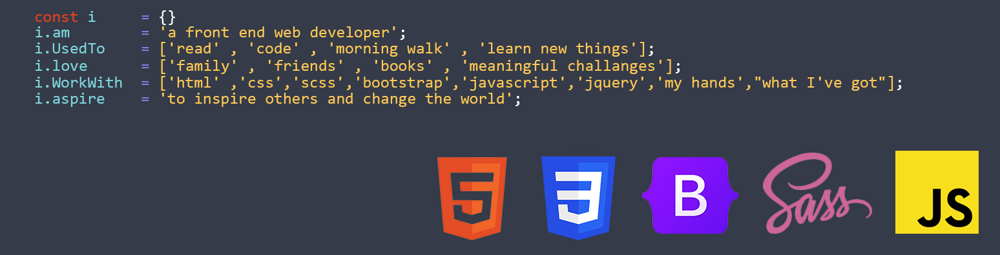

<h1 align="center">Hi 👋, I'm NOMI</h1>
<h3 align="center">I am a skilled front-end web developer with a passion for creating dynamic and engaging user interfaces.</h3>

- 🌱 I’m currently learning **PHP**

- 👨‍💻 All of my projects are available at [https://www.linkedin.com/in/muhammad-nouman-sharif/](https://www.linkedin.com/in/muhammad-nouman-sharif/)

- 💬 Ask me about **HTML,CSS,BOOTSTRAP,JAVASCRIPT**

- 📫 How to reach me **alfaizan.nouman@outlook.com**

<h3 align="left">Connect with me:</h3>

<h3 align="left">Languages and Tools:</h3>

       

